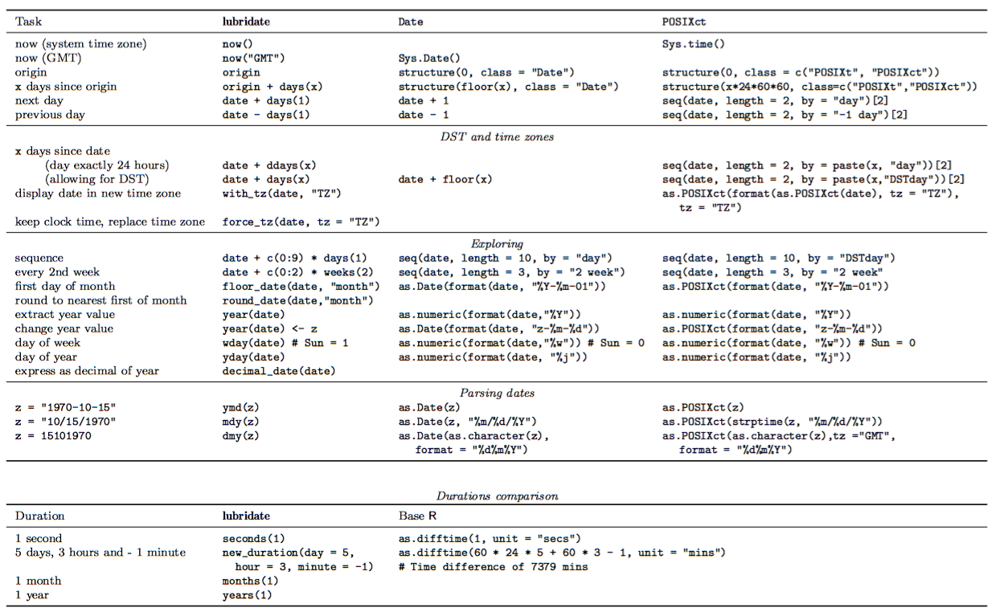

```{r setup, include=FALSE}
knitr::opts_chunk$set(echo = FALSE)
```

## Características generales

- Facilita el manejo de fechas y horas en `R`. 
- Robustece la manipulación de: 
    + Zonas horarias
    + Días bisiestos
    + Horarios de verano

```{r, echo = TRUE, comment=FALSE, warning=FALSE, message=FALSE}
# install.packages("lubridate")
library(lubridate)
```
##
```{r  out.width = "100%", echo=FALSE}
library(knitr)
 
```

## Funciones
- Funciones más intuitivas que las de la base (incluyendo `chron`, `timeDate`, `zoo`, `xts`, `its`, `tis`, `timeSeries`, `fts`, y `tseries`) 
- Analiza rápidamente tiempos: `ymd()`, `dmy()`, `myd()`, ...
- Funciones que extraen y modifican componentes de tiempo (años, meses, días, horas, minutos y segundos): `year()`, `month()`, `day()`, ...
- Ayuda con la manipulación de zonas horarias: `with_tz()`, `force_tz()` 
- Opera matemáticamente objetos del tiempo. 
    + Duraciones: mide la cantidad exacta de tiempo entre dos puntos del tiempo
    + Periodos: hace seguimiento preciso de los tiempos a pesar de tener años bisiestos, segundos intercalares, y horarios de verano.
    + Intervalos: resumen completo de información del tiempo entre dos puntos

# Analizando fechas y horas

## 

**Año - Mes - Día**
```{r, echo=TRUE}
ymd("20110604")
```

**Mes - Día - Año**
```{r, echo=TRUE, warning=FALSE}
mdy("06-04-2011")
```

**Día - Mes - Año**
```{r, echo=TRUE, warning=FALSE}
dmy("04/06/2011")
```

## 

Si el objeto que está manipulando contiene información horaria, puede agregarse h, m o s al nombre de la función. Probablemente `ymd_hms` es el formato de tiempo más utilizado. 

Para leer tiempos de cierta zona horaria, debe suministrarse el nombre oficial de esa zona horaria con el argumento `tz`. 

```{r, echo=TRUE, warning=FALSE}
(arrive <- ymd_hms("2011-06-04 12:00:00", tz = "Pacific/Auckland"))
(leave <- ymd_hms("2011-08-10 14:00:00", tz = "Pacific/Auckland"))

```

# Ajustando y extrayendo información

##

Puede extraerse información sobre el tiempo con las funciones: `second`, `minute`, `hour`, `day`, `wday`, `yday`, `week`, `month`, `year`, y `tz`. Estas funciones también sirven para ajustar la información dada. `wday` y `month` tienen un argumento opcional llamado `label`, el cual reemplaza su salida numérica con el nombre del día de la semana o del mes.

```{r, echo=TRUE, collapse=TRUE}
second(arrive)
second(arrive) <- 25; arrive
second(arrive) <- 0
wday(arrive)
wday(arrive, label = TRUE)
```

## Zonas horarias

Hay dos cosas muy útiles para hacer con el huso horario. 

- Mostrar el mismo momento en distintos husos horarios.
- Crear un momento combinando una hora existente con una nueva. Esto se realiza con las funciones `with_tz` y `force_tz`.

Por ejemplo, hace poco estuve en Auckland, Nueva Zelanda. Acordé una reunión con un amigo a las 9:00 a.m., hora de Auckland. ¿Qué hora era para mi amigo si él estaba en Houston, TX?

```{r, echo=TRUE, warning=FALSE}
meeting <- ymd_hms("2011-07-01 09:00:00", tz = "Pacific/Auckland")
with_tz(meeting, "America/Chicago")
```

Así que la reunión se llevó a cabo a las 4:00 p.m. del día anterior para mi amigo por la curvatura de la tierra. Y si mi amigo hubiera cometido un error y hubiera sido a las 9:00 a.m. de su huso horario, ¿qué hora hubiera sido para mi?

```{r, echo=TRUE, warning=FALSE}
mistake <- force_tz(meeting, "America/Chicago")
with_tz(mistake, "Pacific/Auckland")
```

# Intervalos de tiempo

##

Puede guardar un intervalo de tiempo como un objeto de clase *Intervalo* con `lubridate`. Por ejemplo, mi estadía en Auckland duró desde el 4 de junio de 2011 al 10 de agosto de 2011 (información almacenada en `arrive` y `leave`). Puede crearse un intervalo con estos dos tiempos de dos formas:

```{r, echo=TRUE, warning=FALSE}
(auckland <- interval(arrive, leave))
(auckland <- arrive %--% leave)
```

Por ejemplo, si una amiga viajó fuera del país desde el 20 de julio hasta finales de agosto, ¿mi visita se cruzará con sus viajes?

```{r, echo=TRUE, warning=FALSE}
(jsm <- interval(ymd(20110720, tz = "Pacific/Auckland"), ymd(20110831, tz = "Pacific/Auckland")))
```

```{r, echo=TRUE, warning=FALSE}
int_overlaps(jsm, auckland)
```

##
¿En qué parte de mi visita, podremos coincidir?
```{r, echo=TRUE, warning=FALSE}
setdiff(auckland, jsm)
```

Otras funciones que trabajan bien con intervalos incluyen: `int_start`, `int_end`, `int_flip`, `int_shift`, `int_aligns`, `union`, `intersect`, `setdiff`, y `%within%`.

# Aritmética sobre objetos en el tiempo

##
Los intervalos son periodos de tiempo específicos, sin embargo `lubridate` también provee dos clases de periodos de tiempo: Duraciones y Periodos. Las funciones auxiliares para crear periodos, deben invocarse después de las unidades de tiempo (en plural). Las funciones auxiliares para crear duraciones siguen el mismo formato pero comienzan con una "d" (por duración) o "e" (por exacto)

```{r, echo=TRUE, warning=FALSE}
minutes(2) ## period
dminutes(2) ## duration
```

**¿Por qué dos clases?** 

Porque la línea del tiempo no es tan confiable como la recta numérica. 

- La clase *Duración* siempre suministrará resultados matemáticamente precisos. La duración de un año siempre será igual a 365 días. 

- Los *Periodos* fluctúan de la misma manera que lo hace la línea del tiempo. Esto los hace útiles para el modelado de las horas del reloj.

## 

Por ejemplo, las *duraciones* serán precisas al enfrentarse con años bisiestos, sin embargo los *periodos* retornan lo que intuitivamente se pretende:

```{r, echo=TRUE, collapse=TRUE, warning=FALSE}
leap_year(2011) ## regular year
ymd(20110101) + dyears(1)
ymd(20110101) + years(1)
```

```{r, echo=TRUE, collapse=TRUE, warning=FALSE}
leap_year(2012) ## leap year
ymd(20120101) + dyears(1)
ymd(20120101) + years(1)
```

##

Puede usar *periodos* y *duraciones* para realizar operaciones aritméticas básicas con objetos del tiempo.  Por ejemplo, si quisiera establecer una reunión semanal con mi amigo, sería:

```{r, echo=TRUE, warning=FALSE}
(meetings <- meeting + weeks(0:5))
```

Si mi amigo y mi amiga viajaron al mismo tiempo, ¿cuál de las reuniones se verían afectadas? Las últimas dos.

```{r, echo=TRUE, warning=FALSE}
meetings %within% jsm
```

¿Cuánto duró mi estadía en Auckland?
```{r,echo=TRUE, collapse=TRUE, warning=FALSE}
auckland / ddays(1)
auckland / dminutes(1)
```

##
También es posible realizar operación módulo y división entera. Algunas veces es más sensible que la división normal puesto que no es tan obvio expresar un residuo como una fracción de un mes porque la longitud de los meses cambia constantemente.

```{r, echo=TRUE, warning=FALSE}
auckland %/% months(1)
auckland %% months(1)
```


Módulo con un intervalo de tiempo devuelve el residuo como un nuevo intervalo (más pequeño). Puede cambiarlo a cualquier intervalo en un lapso de tiempo generalizado con `as.period`.

```{r, echo=TRUE, warning=FALSE}
as.period(auckland %% months(1))
as.period(auckland)
```

# Si alguien condujera una máquina del tiempo, se estrellaría

##

La longitud  de los meses y años cambia constantemente, de tal suerte que hacer operaciones aritméticas no sería tan intuitivo. 

Considere una operación simple, `January 31st + one month`. La respuesta debería ser:

1. `February 31st` (no existe)
2. `March 4th` (31 días después  de Enero 31), o
3. `February 28th` (asumiendo que no sea un año bisiesto)

Una propiedad básica de la aritmética  es que `a + b - b = a`. Únicamente la solución 1 obedece a esta propiedad pero es una fecha inválida. `lubridate` es tan consistente como puede ser posible al invocar la siguiente regla: *si al adherir o sustraer un mes o un año, se obtiene un tiempo inválido, `lubridate` retornará un NA*

##

Sin embargo es posible conseguir los resultados 2 y 3 con aritmética inteligente o usando los operadores especiales `%m+%` y `%m-%`. Estos automáticamente se remontarán al último día del mes, de ser necesario.

```{r, echo=TRUE, warning=FALSE}
jan31 <- ymd("2013-01-31")
jan31 + months(0:11)
floor_date(jan31, "month") + months(0:11) + days(31)
jan31 %m+% months(0:11)
```

Esto sólo afectará a la aritmética con meses (y con los años si la fecha de inicio es Feb 29).
